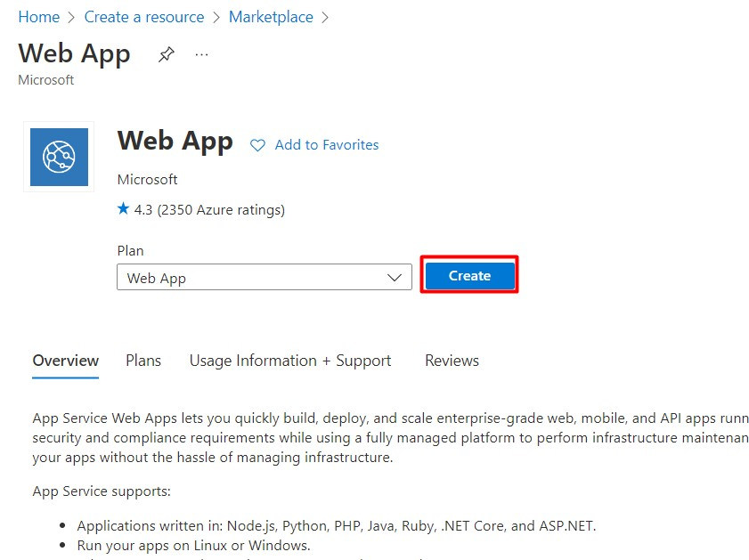
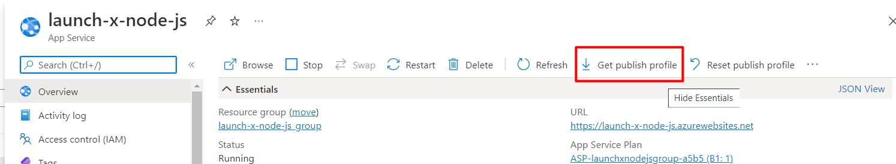
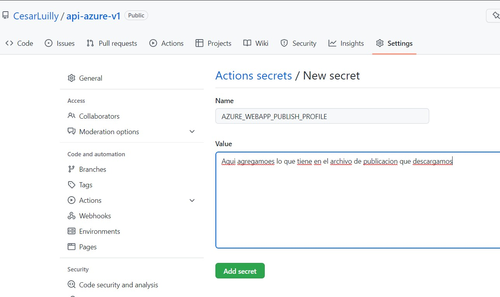
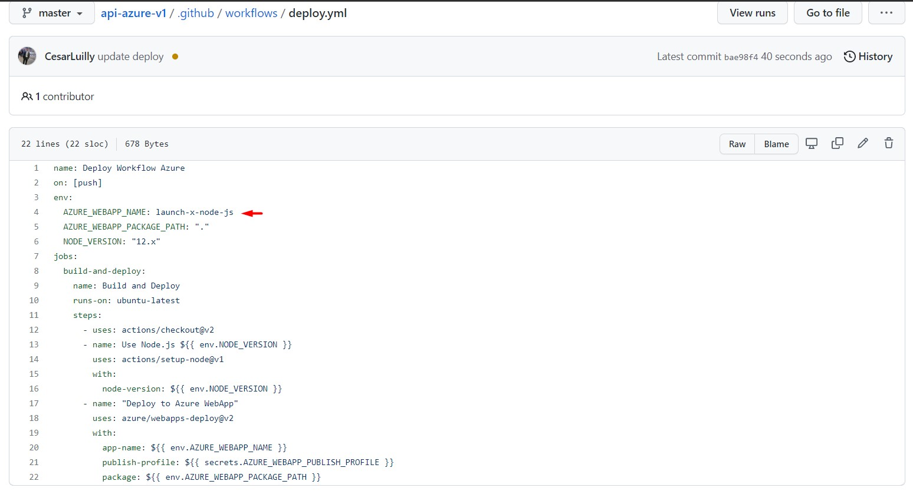

# Node.js Hello World!!!!

This sample demonstrates a tiny Hello World node.js app for [App Service Web App](https://docs.microsoft.com/azure/app-service-web).

## Quotes json

https://github.com/JamesFT/Database-Quotes-JSON

# Pasos en Azure

1. Crear un WebApp para NodeJS 16

2. Descargamos nuestro publish profile

3. Agregamos un Actions Secrets(el secrets no es mas que la configuracion de nuestra WebApp).

4. Agregamos un Workflow con el siguiente informacion (Nota. La siguiente informacion se consulto en referencias de azure, solo se modificaron ciertos parametros como el nombre de webapp)

